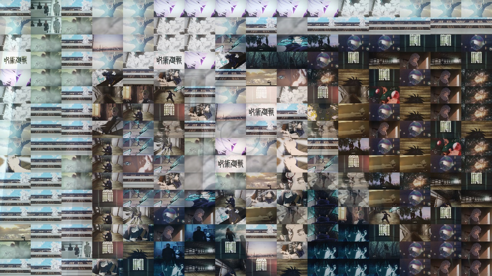

# Photo Mosaic (Added limited support for video)

### Requirements

Python 3, OpenCV 4(<code>pip install opencv-python </code>), Numpy<code>pip install numpy</code>, tqdm (<code>pip install tqdm </code>)

# How to Use

1. Clone or Download Repo
2. Prepare images to create mosaic [and add to the folder called images] (about 20,30 works. More images of different color leads to better mosaics).

- <h2> Note: Use this to create sample images from video </h2> (https://trac.ffmpeg.org/wiki/Create%20a%20thumbnail%20image%20every%20X%20seconds%20of%20the%20video)

3. Open CMD in the repo location and run mosaic.py <code> python mosaic.py </code> (https://www.thewindowsclub.com/how-to-open-command-prompt-from-right-click-menu/)

- <h3> For Multithreaded, see example below </h3>
- <h2> Note: If you want the above command to work, copy your image into the folder and rename it to me.jpg and add other image samples in the folder called images</h2>
- <h3> Use <code> -i [path] </code> flag to add your content image
- <h3> Use <code> -d </code> to add you datasets of images
- <h3> Use <code> -r </code> to division of the image (Optional) . <b> Default is 32. Higher value leads to better picture but it takes more time. </b>
- <h3> Use <code> -s </code> to specify size of output (Optional)
- <h3> Use <code> -o [path] </code> to save image. (Add filename with path)

<h3> Note: MultiThreaded is faster but does not produce as good result as single threaded </h3>
<h1> Example </h1>
<code>python mosaic.py -i dicaprio.jpg -r 50 -o diCaprio_mosaic.jpg</code>
OR
<code>python mosaic_multiThreaded.py -i dicaprio.jpg -r 50 -o diCaprio_mosaic.jpg</code>

<h3> Input </h3>

<h3> Ouptut </h3>
</img>
<h3> MultiThreaded Ouptut (-r 90) </h3>

<code>python mosaic.py -i me.jpg -r 64 -d ./images -s 600 600 -o ./output.jpg </code>

<h3> Input </h3>

<h3> Ouptut </h3>

<h3> MultiThreaded Ouptut </h3>

## VIDEO
### IT TAKES A LONG TIME TO PROCESS IT
(Original video)(https://www.youtube.com/watch?v=_uqm-Ans1rU)
See output.avi for processed video, using default settings.
